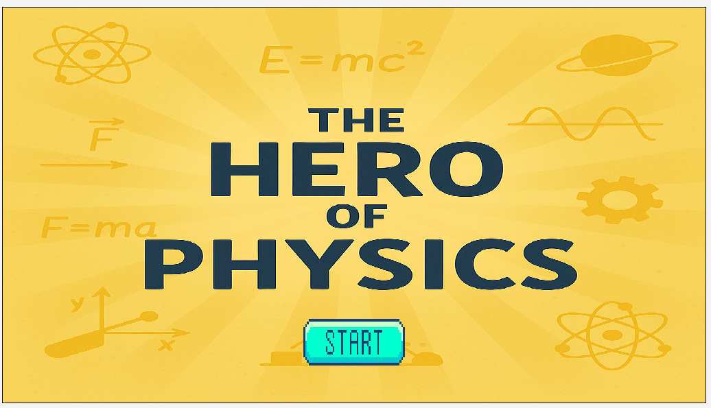
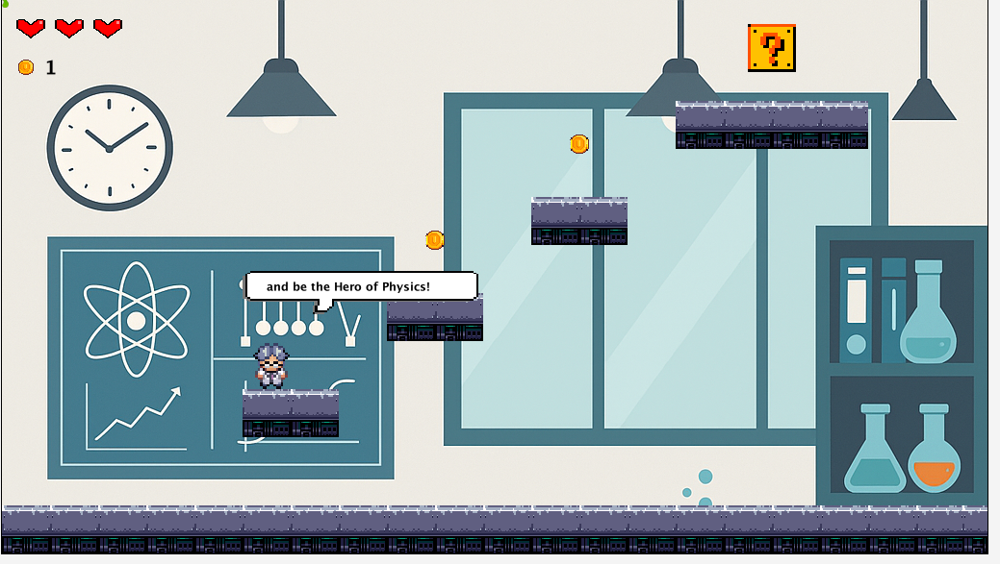
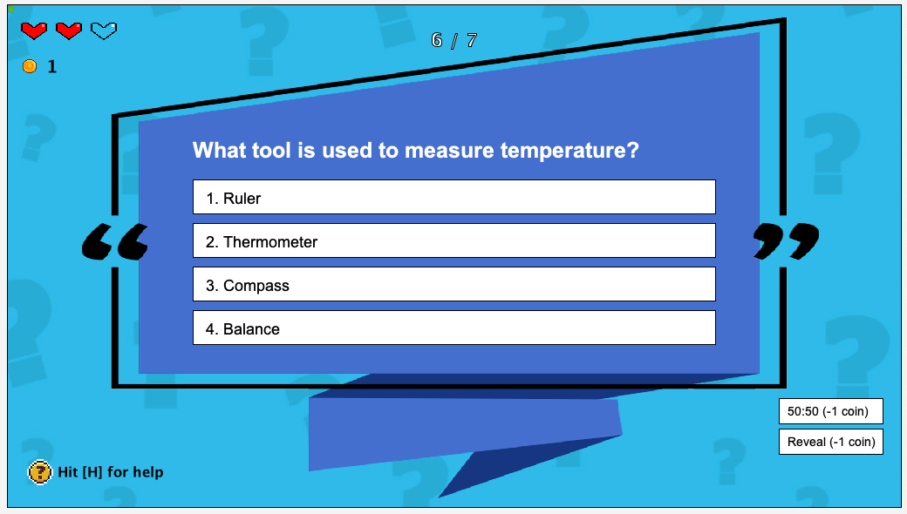
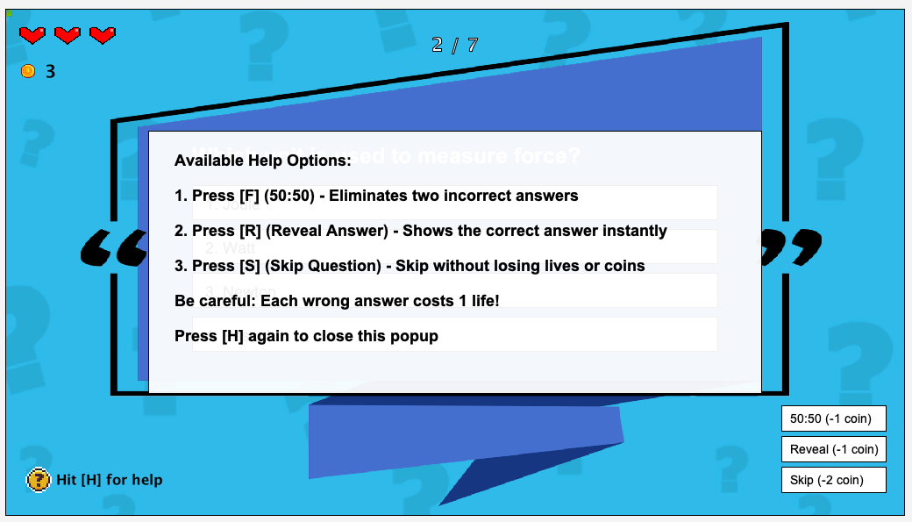
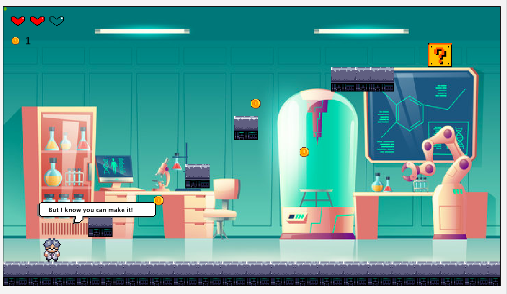
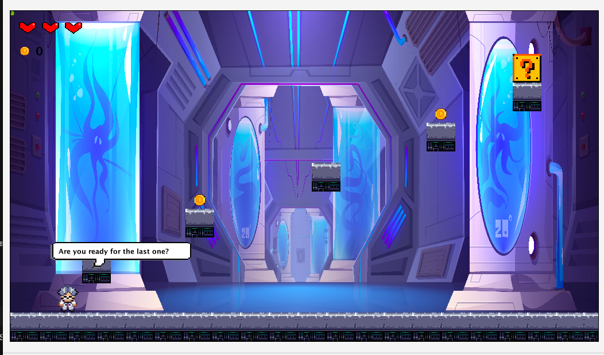
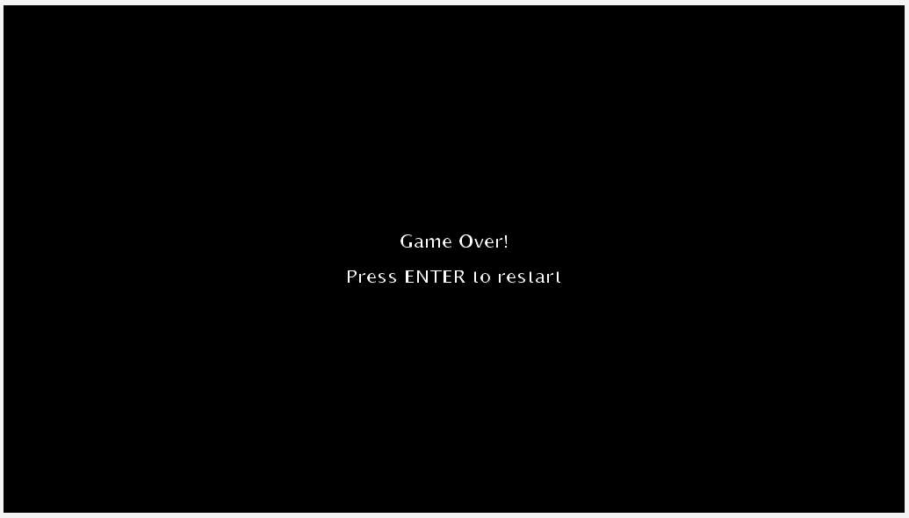
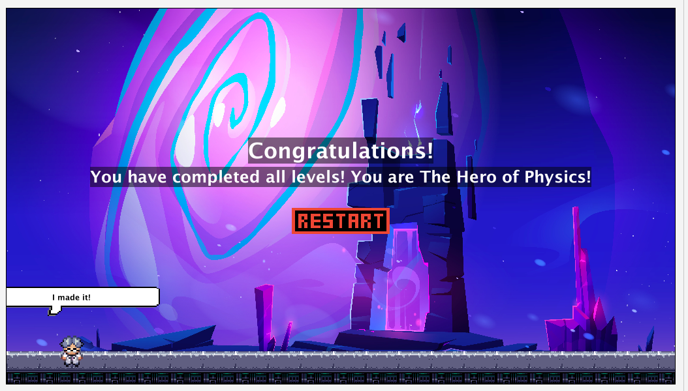

# The Hero of Physics

**The Hero of Physics** is a serious game built in [Greenfoot](https://www.greenfoot.org/), designed to teach physics concepts through platformer-style gameplay and interactive quizzes. The player navigates levels, collects coins, answers multiple-choice questions, and unlocks help options to succeed.

## Gameplay Features

- Animated player character with speech bubble dialogue
- Coin collection with score tracking
- Quiz system with:
    - Multiple-choice questions
    - Help options: 50:50, Reveal Answer, and Skip
    - Coin-based help usage
- Educational messages to reinforce learning
- Platform-based level design with increasing difficulty
- Background music and sound effects
- Win screen and Game Over state

## How to run
1. Open Greenfoot. 
2. Import or open the The_Hero_of_Physics project folder. 
3. Click Compile. 
4. Right-click MenuWorld and select "new MenuWorld()", then click Run.

## Learning Goals
- Promote critical thinking via quizzes 
- Reinforce core physics knowledge through challenge 
- Reward correct answers with game progression and feedback

## Authors
- Nouni Theodora 
- Anastasia Pourliaka

## Screenshots from the game

